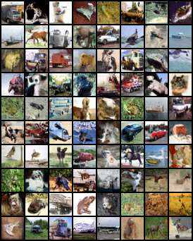
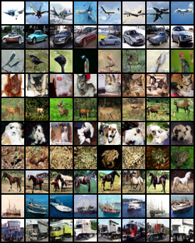
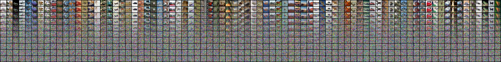

# Training Denoising Diffusion Probability Model (DDPM) on CIFAR-10
This is a fork of github repo: https://github.com/zoubohao/DenoisingDiffusionProbabilityModel-ddpm-
I modify the code to make it easier to run and add some comments to make it easier to understand.
I also trained the model on CIFAR-10 dataset and upload the pretrain weight, in [Checkpoints](./Checkpoints/) folder.
CIFAR-10 dataset is in [CIFAR10](./CIFAR10/)

To provide a vivid example of diffusion process, I also add a part to demonstrate the diffusion process of DDPM. The result is in [SampledImgs](./Imgs/NoGuidence_diffusion_visualization/)
## How to run
### 0. Install the requirements
```bash
pip install torch torchvision numpy tqdm
```

### 1. Train the model
train the model without guidence:
```bash
python Main.py --state train 
```
it takes about 3 minutes to train one epoch on a single V100 GPU. It takes 10 hours to train 200 epochs.
The ckeckpoint used to generate image is ckpt_150_.pt

train the model with guidence:
```bash
python MainCondition.py --state train
```
see [Main.py](./Main.py) and [MainCondition.py](./MainCondition.py) for more details about the parameters.

### 2. Generate images
```bash
python Main.py --state eval --sampled_dir ./out --save_weight_dir ./Checkpoints/ --test_load_weight ckpt_150_.pt
```

generate image with intermediate steps:
```bash
python Main.py --state eval --sampled_dir ./out --test_load_weight ckpt_150_.pt --save_middle_result True
```

generate images with guidence:
```bash
python MainCondition.py --state eval --sampled_dir ./out --test_load_weight ckpt_59_.pt
```
## result and demostration
see [NoGuidence](./Imgs/NoGuidence/) and [Guidence](./Imgs/Guidence/) for the generated images.
### 1. No guidence

### 2. Guidence

### 3. Diffusion process


the following part is the original README.md
# DenoisingDiffusionProbabilityModel
This may be the simplest implement of DDPM. I trained with CIFAR-10 dataset. The links of pretrain weight, which trained on CIFAR-10 are in the Issue 2. <br>
<br>
If you really want to know more about the framwork of DDPM, I have listed some papers for reading by order in the closed Issue 1.
<br>
<br>
Lil' Log is also a very nice blog for understanding the details of DDPM, the reference is 
"https://lilianweng.github.io/posts/2021-07-11-diffusion-models/#:~:text=Diffusion%20models%20are%20inspired%20by,data%20samples%20from%20the%20noise."
<br>
<br>
**HOW TO RUN**
* 1.  You can run Main.py to train the UNet on CIFAR-10 dataset. After training, you can set the parameters in the model config to see the amazing process of DDPM.
* 2.  You can run MainCondition.py to train UNet on CIFAR-10. This is for DDPM + Classifier free guidence.

Some generated images are showed below:

* 1. DDPM without guidence:


* 2. DDPM + Classifier free guidence:


